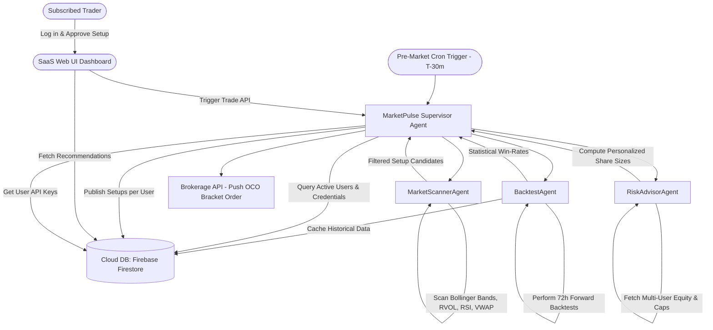
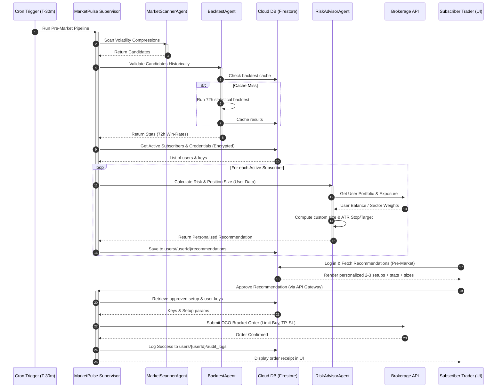

# MarketPulse Advisor - Agent Architecture Design Document

## 1. Requirements Analysis

*   **User Problem**: Short-term traders and swing traders struggle with "analysis paralysis" and execution friction. They must scan thousands of fast-moving stocks in real-time, perform manual backtesting to validate setups historically, calculate precise risk parameters, and manually place multi-bracket orders under tight timelines.
*   **Target Outcome**: An automated, intelligent dashboard agent that scans the market for high-propensity 2-to-3-day volatility breakouts, backtests candidates over a 10-year period, applies strict Risk-of-Ruin formulas, and displays 2-3 actionable setups on a morning dashboard 30 minutes before market open. Traders can approve a setup to instantly push formatted bracket orders to their brokerage.
*   **Key Constraints**:
    *   **Scope Limit**: The agent is not an autonomous trading bot. It functions as a pre-market scanner, dashboard recommender, and order builder. Executions only happen with explicit human approval.
    *   **Data Dependencies**: Integration with real-time and historical APIs (Polygon.io or Alpaca Markets), fundamental events (FMP or Alpha Vantage), and news/order-flow sentiment (Benzinga Pro).
    *   **Strict Risk Rules**: Minimum 1:3 Risk-to-Reward ratio, maximum 3 concurrent positions, 20% sector exposure caps, and a hard 2.5% daily account equity loss limit.
*   **Clarification Log**:
    *   *Q: Does the agent need to manage the lifecycle of active positions (e.g., trailing stops, 72-hour liquidations)?* -> *A: No, it is a dashboard recommendation agent. Trades are executed via bracket orders sent to the brokerage, which handles the lifecycle (SL/TP) natively.*
    *   *Q: Is there an existing historical candle database?* -> *A: No. Pricing data is retrieved from external APIs. The agent architecture may optionally persist and cache data locally to avoid rate-limiting.*
    *   *Q: How does the agent monitor portfolio limits (daily loss limit, concurrent positions)?* -> *A: The agent fetches active portfolio equity, positions, and daily PnL directly from the brokerage API during its run sequence.*
    *   *Q: When does the agent execute?* -> *A: Runs automatically 30 minutes before the market opens (T-30m).*

---

## 2. Architecture Design

### 2.1 High-Level Strategy
*   **Pattern**: Multi-Agent Delegation (Supervisor-Router Pattern).
*   **Rationale**: The complexity of combining real-time multi-indicator scanning, heavy historical backtesting, and brokerage portfolio verification makes a single-agent architecture prone to logic drift and context overload. By separating these concerns, we ensure high reliability for the critical risk and execution layers.

### 2.2 System Diagram (Logical - Multi-Tenant SaaS)


### 2.3 Components

#### **A. Agents**
| Agent Name | Type | Model | Role/Persona |
| :--- | :--- | :--- | :--- |
| `MarketPulseSupervisor` | `Orchestrator/Router` | `gemini-3.5-flash` | Manages the orchestrational flow, aggregates results from subagents, formats the morning dashboard payload, and processes user approval actions. |
| `MarketScannerAgent` | `Task Agent` | `gemini-3.5-flash` | Connects to market data providers (Alpaca/Polygon) to scan and filter equities based on technical indicators (Bollinger Band squeeze, RVOL >= 2.5x, RSI crossing 50, VWAP). |
| `BacktestAgent` | `Task Agent` | `gemini-3.5-flash` | Runs historical pattern matching (last 50 occurrences across 500 liquid stocks over 10 years) using local cached data or pricing APIs. Outputs statistical win/loss ratios and drawdown. |
| `RiskAdvisorAgent` | `Task Agent` | `gemini-3.5-flash` | Queries account equity, validates exposure thresholds, calculates position sizing via the Risk-of-Ruin formula, and derives entry/exit bracket parameters using hourly ATR. |

#### **B. Database Schema & State (Firebase Firestore)**
| Collection/Field | Type | Description | Purpose |
| :--- | :--- | :--- | :--- |
| `users` | `Collection` | Multi-tenant user profiles, encrypted brokerage API credentials, and preferences. | SaaS Multi-tenancy |
| `scans` | `Collection` | Daily technical scan outputs (`scanner_candidates`) cached globally. | System Efficiency |
| `backtests` | `Collection` | Historical 72h validation stats mapped by pattern/symbol. | Query Performance |
| `users/{userId}/recommendations` | `Collection` | Tailored 2-3 daily setups with custom position sizing, Stop-Loss, and Take-Profit. | Client UI Sync |
| `users/{userId}/audit_logs` | `Collection` | Execution history of user approvals, API calls, and account circuit breaker events. | Compliance & Analytics |

#### **C. Tools**
| Tool Function | Description | Dependencies |
| :--- | :--- | :--- |
| `get_market_scans` | Scans market database/Alpaca API for BB squeeze, RSI, volume, and VWAP confluences. | Alpaca / Polygon SDK |
| `run_backtest` | Queries historical pricing data for 50 occurrences; checks/updates cloud backtest cache. | Firestore / Polygon SDK |
| `get_portfolio_data` | Retrieves account equity, daily PnL, and positions for a specific user using their keys. | Firebase / Brokerage API |
| `submit_bracket_order` | Submits OCO Limit Buy, Take-Profit, and Stop-Loss orders using the user's keys. | Firebase / Brokerage API |

### 2.4 Execution Flow (Sequence - Multi-Tenant SaaS)


---

## 3. Evaluation Plan

### 3.1 Strategy
*   **Methodology**: System-level integration testing with mocked brokerage responses, combined with performance testing of backtesting queries to verify latency constraints.
*   **Tools**: `pytest` for unit testing logic engines; mock data profiles to simulate market scanners and backtest runs.

### 3.2 Metrics
1.  **Scanner Accuracy**: 100% of candidate stocks must match the Bollinger Band squeeze, RVOL, and RSI rules.
2.  **Risk Formula Integrity**: Position sizes must exactly match:
    $$S = \frac{E \times R}{P_e - P_s}$$
    where $R$ is capped between 1% and 1.5%.
3.  **Safety Compliance**: No trades are generated if daily account loss exceeds 2.5%, open trades exceed 3, or a sector exposure exceeds 20%.

### 3.3 Test Scenarios
#### **Scenario 1: Happy Path**
*   **Input**: Cron trigger runs pre-market; account has 0 open positions and $100,000 equity.
*   **Expected Output**: 2-3 setups identified with >55% backtest win-rates. Risk-of-Ruin sizes calculated with a 1% risk limit. Bracket order generated at exactly 1:3 R:R.

#### **Scenario 2: Circuit Breaker Triggered (Daily Loss)**
*   **Input**: Pre-market run. Brokerage reports daily PnL of -$3,000 (3% loss on a $100k account).
*   **Expected Behavior**: Agent stops processing immediately and returns a critical alert: "Pre-Market Scanner Halted: 2.5% Daily Loss Limit Breached."

#### **Scenario 3: Correlation Cap Enforcement**
*   **Input**: Scanner returns 3 candidates in the Tech sector. Account already holds 1 tech stock representing 15% of equity.
*   **Expected Behavior**: RiskAdvisorAgent filters out or scales down the tech candidates to prevent tech sector concentration from exceeding the 20% limit.

---

## 4. Development & Testing Considerations (SaaS Cloud Topology)

### 4.1 Environment Differences
*   **Multi-Tenancy & Auth**: In production, trader accounts are managed via **Firebase Auth**. Brokerage API credentials (e.g., Alpaca keys) are stored encrypted in **Firebase Firestore** using symmetric encryption with keys hosted in **Google Cloud Secret Manager**.
*   **Database**: Development uses the **Firebase Local Emulator Suite** (Firestore Emulator) to simulate database operations. Production uses a live Firestore project instance.
*   **Brokerage API**: Local development and user testing default to the Alpaca Paper Trading endpoint, while SaaS production routes to the user's specific live Alpaca API endpoint dynamically retrieved during run-time.

### 4.2 Local Setup
1.  Install the Firebase CLI and start the emulator suite:
    ```bash
    firebase emulators:start
    ```
2.  Define environment variables in a local `.env` file for the agent worker:
    ```bash
    USE_FIREBASE_EMULATOR="true"
    FIRESTORE_EMULATOR_HOST="localhost:8080"
    POLYGON_API_KEY="your_polygon_key"
    GEMINI_API_KEY="your_gemini_key"
    ENCRYPTION_KEY_SECRET="your_local_secret_key"
    ```
3.  Run the local SaaS multi-user test suite:
    ```bash
    pytest tests/
    ```
